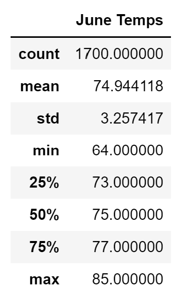
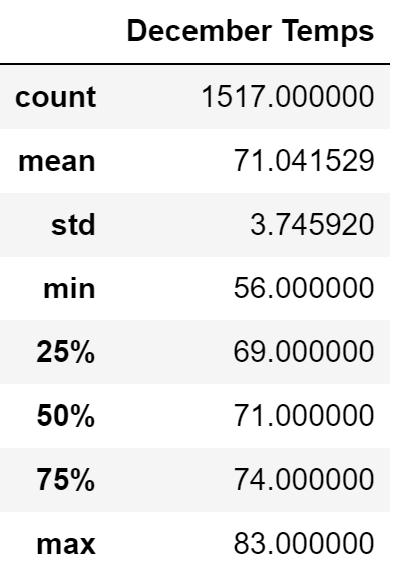
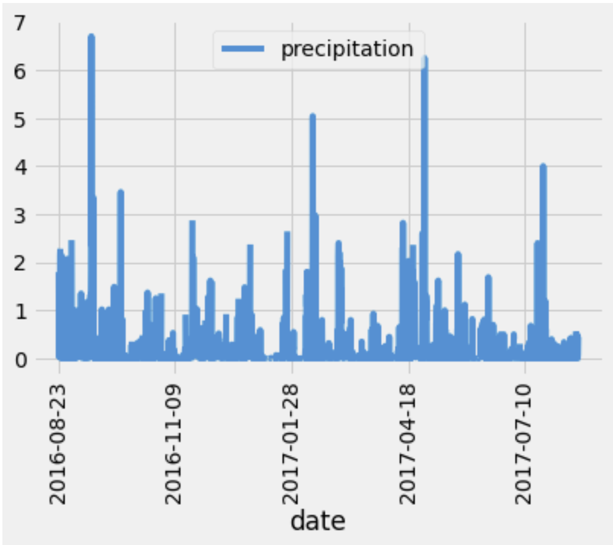
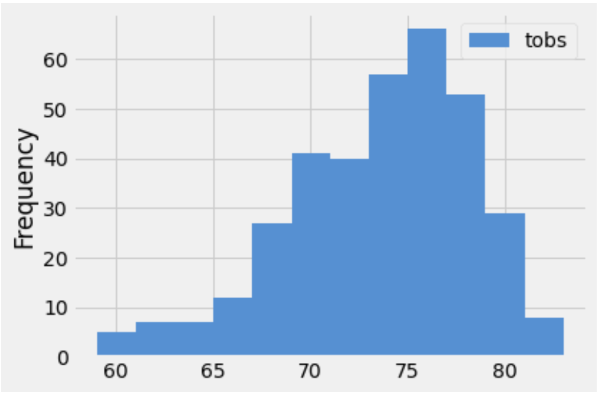

# surfs_up
## Overview of the analysis
___
In this analysis, I utilized a database on Sqlite and used Panads DataFrame to query and analyze weather data for Oahu
## Results

* From the Results it can be seen that both temperatures in the month of June and the Month of December are roughly the same. 
 
* Planning a trip to Oahu in June versus December wouldn't have a huge difference in terms of temperature. The average temp season round is around 75 with lows of 60 and highs of 85.

* Average rainfall varies greatly, cannot really predict. Sometimes precipitation is highest in September, Feb, May and August.

## Summary
* The weather in Oahu is quite stable, there aren't extreme colds or extreme heat, and the temperature follows a pretty tight spectrum from 65 degrees - 85 degrees year round.
* Average Precipatation is more difficult to measure since looking at fig2, it follows quite a random pattern. 